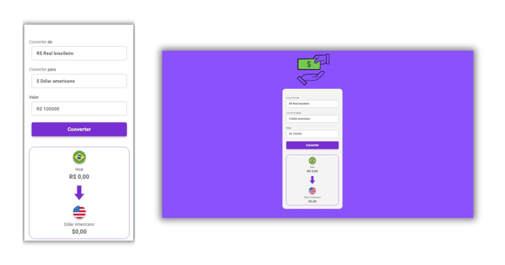

## Currency Converter

Project completed as a challenge in the DevClub

## What is it?
This Currency Converter was designed with simplicity and functionality in mind, created as a practical example to enhance my skills in HTML, CSS, 
and JavaScript. The focus is on delivering a user-friendly interface, making it easy to perform quick and accurate currency conversions while 
showcasing clean and modern design principles.

## Technologies:

## Site Link:
https://conversordemoedasproject.netlify.app/
